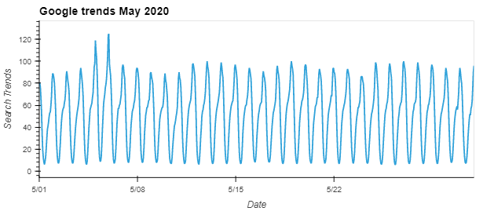
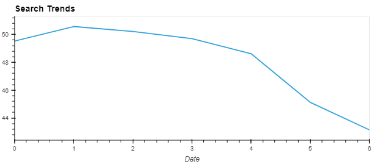
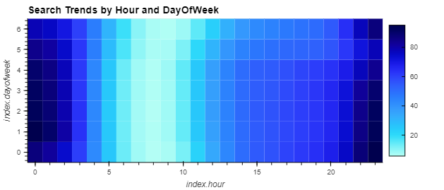
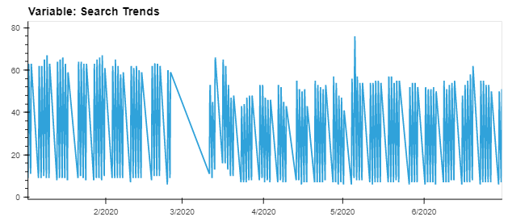
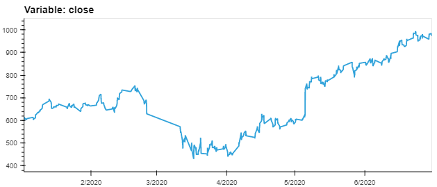
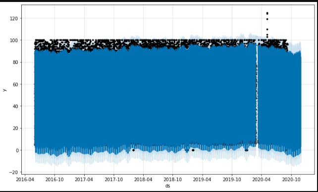
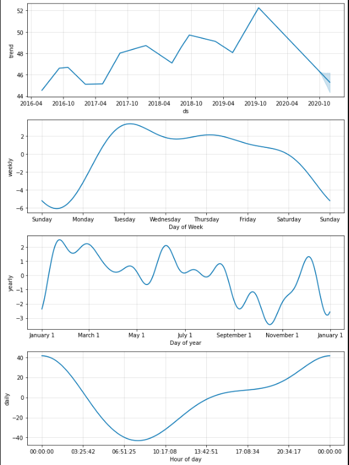

# Forecasting Net Prophet

With over 200 million users, `Mercado Libre` is the most popular e-commerce site in Latin America. `Mercado Libre` has requested an analysis of the company's financial and user data and ways to help the company grow.

## Google search trends
An analysis of the Google's hourly search traffic for the period from `June 2016` to `August 2020` showed that interest in `Mercado` peaks in the late evening hours each day and drops significantly in the mornings.  An increase in interest during `May 2020` when the `Mercado` released its financial results to the market was also noted with traffic increasing by `7%`.

Whilst on average, interest in `Mercado` peaks on `Tuesdays`, and on most days, interest is greatest during the hours of `1pm` and `4am`.

Examining the yearly picture reveals that interest is highest during the first `10` weeks of the year before dropping off until the winter holiday season when it increases again.

## Search trends and stock price
No clear relationship can be observed between search trends and `Mercado's` stock price.

A review of the lagged search traffic and the stock volatility shows a weak correlation.
||Stock Volatility|Lagged Search Trends | Hourly Stock Return|
|-|-|-|-|
|Stock Volatility|1.000000|-0.148938|0.061424|
|Lagged Search Trends|-0.148938|1.000000|0.017929|
|Hourly Stock Return|0.061424|0.017929|1.000000|

## Forecast
Using the `Prophet` timeseries model, we found that interest is likely to trend downards before recovering, whist the greatest popularity will be around `midnight`, `Tuesdays` will get the most traffic however `Octber` will be `Mercado's` lowest point.

The expected number of sales for the next quarter is USD 969.60m with a best case of USD 1050.90m and a worst case of USD 887.66m.